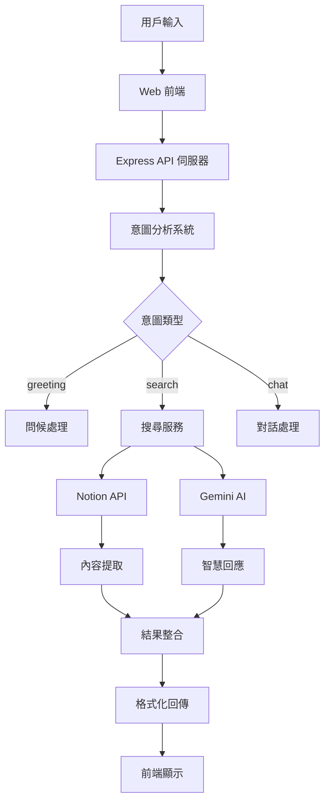

# Notion Chat App

> 🤖 AI 驅動的 Notion 知識庫問答助手
>
> 使用 Express + Gemini AI + Notion API 構建的網頁聊天應用，讓你的 Notion 工作區變成智能對話夥伴

[](https://github.com/Qoo143/notion-chat-app)
[](LICENSE)
[](https://nodejs.org)

## 📖 專案概述

**Notion Chat App** 是一個使用 Express 構建的網頁聊天應用程式，整合了 Notion API 和 Google Gemini AI。使用者可以透過自然語言搜尋他們的 Notion 工作區，並獲得 AI 驅動的智慧回應以及相關頁面的直接連結。

現已部署於 Render 平台，支援自動部署更新。

### ✨ 核心特色

- 🔍 **智慧搜尋**: 多輪搜尋策略，從快速到精確的可調節搜尋深度
- 🧠 **意圖分析**: AI 自動分析用戶意圖 (問候/搜尋/對話)
- 📚 **深度整合**: 完整的 Notion 頁面內容提取與格式保留
- ⚡ **高效能**: 多 API Key 輪替，智慧錯誤處理
- 🎨 **現代 UI**: 直觀的聊天介面，即時狀態回饋，大地色系設計
- 🌐 **Web 應用**: 直接在瀏覽器中使用，無需安裝任何軟體

### 🎯 適用場景

- 📝 **知識管理**: 快速搜尋大量 Notion 筆記和文件
- 💡 **內容發現**: 透過自然語言找到相關資料
- 🤔 **問答系統**: 對 Notion 內容進行智慧問答
- 📊 **資料查詢**: 高效率的工作區內容檢索

## 🏗 技術架構



### 🛠 技術堆疊

| 層級 | 技術 | 版本 | 用途 |
|------|------|------|------|
| **前端** | HTML/CSS/JS | - | 網頁介面 |
| **後端** | Express.js | ^4.18.2 | Web 伺服器 |
| **AI** | Google Gemini | ^0.2.1 | 智慧分析與回應 |
| **API** | Notion Client | ^2.2.13 | 工作區數據存取 |
| **工具** | Axios | ^1.6.0 | HTTP 客戶端 |
| **配置** | dotenv | ^16.3.1 | 環境變數管理 |
| **部署** | Render | - | 雲端平台部署 |

## 🚀 快速開始

### 前置要求

- Node.js >= 18.0.0
- npm >= 8.0.0
- Notion Integration Token
- Google Gemini AI API Key

### 本地開發

1. **克隆專案**
   ```bash
   git clone https://github.com/Qoo143/notion-chat-app.git
   cd notion-chat-app
   ```

2. **安裝依賴**
   ```bash
   npm install
   ```

3. **環境配置**
   ```bash
   # 複製環境變數範本
   cp .env.example .env

   # 編輯 .env 檔案，填入你的 API 金鑰
   NOTION_TOKEN=ntn_your_notion_integration_token
   GEMINI_API_KEY=AIzaSy_your_gemini_api_key
   PORT=3002
   ```

4. **啟動應用**
   ```bash
   # 開發模式
   npm run dev

   # 生產模式
   npm start
   ```

5. **瀏覽器開啟**
   前往 `http://localhost:3002`

### 📋 可用指令

| 指令 | 功能 |
|------|------|
| `npm start` | 啟動生產模式伺服器 |
| `npm run server` | 啟動開發模式伺服器 |
| `npm run dev` | 啟動開發模式 (同 server) ⭐ |
| `npm run build:css` | 編譯 SCSS 樣式 |
| `npm run watch:css` | 監控 SCSS 變化並自動編譯 |

## ⚙️ 配置說明

### 環境變數設定

在 `.env` 檔案中配置以下變數：

```bash
# Notion API 設定 (必須)
NOTION_TOKEN=ntn_your_notion_integration_token

# Gemini API 設定 - 支援多 Key 輪替 (必須)
GEMINI_API_KEY=AIzaSy_your_primary_key
GEMINI_API_KEY_2=AIzaSy_your_backup_key_2  # 可選
GEMINI_API_KEY_3=AIzaSy_your_backup_key_3  # 可選

# 伺服器設定 (可選)
PORT=3002                    # 預設: 3002
HOST=0.0.0.0                 # 部署時使用 0.0.0.0
NODE_ENV=production          # 生產環境
```

### Notion Integration 設定

1. 前往 [Notion Integrations](https://www.notion.so/my-integrations)
2. 建立新的 Integration
3. 複製 Integration Token (以 `ntn_` 開頭)
4. 將 Integration 加入到你要搜尋的 Notion 頁面

### Google Gemini API 設定

1. 前往 [Google AI Studio](https://makersuite.google.com/app/apikey)
2. 建立 API Key (以 `AIzaSy` 開頭)
3. 建議設定多個 API Key 以避免配額限制

## 🌐 Render 部署

### 自動部署設定

你的專案已連結到 GitHub，Render 會在每次推送到 master 分支時自動部署：

1. **推送更新**
   ```bash
   git add .
   git commit -m "your commit message"
   git push origin master
   ```

2. **自動觸發**: Render 會自動檢測到推送並開始部署

3. **部署狀態**: 可在 Render Dashboard 監控部署進度

### 環境變數設定 (Render)

在 Render Dashboard 設定以下環境變數：
- `NOTION_TOKEN`
- `GEMINI_API_KEY`
- `NODE_ENV=production`
- `PORT=3002` (可選，Render 會自動設定)

## 💬 使用方法

### 基本操作

1. **開啟網頁**: 前往部署的 URL 或本地 `http://localhost:3002`
2. **選擇搜尋模式**:
   - 單循環 (快速) - 基本搜尋
   - 雙循環 (平衡) - 優化搜尋
   - 三循環 (精確) - 深度搜尋
3. **輸入查詢**: 使用自然語言描述你要找的內容
4. **查看結果**: AI 會分析並回傳相關的 Notion 頁面和智慧回應

### 支援的查詢類型

#### 🔍 搜尋查詢
```
找一下關於 JavaScript 的筆記
有沒有專案管理相關的文件？
幫我查找會議記錄
```

#### 👋 問候對話
```
你好
嗨！
早安
```

#### 💭 一般對話
```
如何學習 React？
什麼是人工智慧？
```

## 📡 API 架構

### 核心端點

| 方法 | 端點 | 描述 |
|------|------|------|
| POST | `/api/chat` | 主要聊天介面，支援多輪搜尋 |
| GET  | `/api/test-notion` | 測試 Notion API 連線 |
| GET  | `/api/health` | 伺服器健康檢查 |
| GET  | `/api/api-status` | API Keys 狀態檢查 |

### 請求範例

```javascript
// 發送聊天訊息
const response = await fetch('/api/chat', {
  method: 'POST',
  headers: { 'Content-Type': 'application/json' },
  body: JSON.stringify({
    message: '找一下 JavaScript 相關的筆記',
    maxRounds: 2  // 搜尋輪數 (1-3)
  })
});
```

### 回應格式

```json
{
  "success": true,
  "response": "AI 產生的智慧回應...",
  "foundPages": [
    {
      "id": "page-id",
      "title": "頁面標題",
      "url": "https://www.notion.so/...",
      "snippet": "頁面摘要..."
    }
  ],
  "intent": "search",
  "apiStats": {
    "notionCalls": 2,
    "geminiCalls": 3,
    "totalCalls": 5
  }
}
```

## 🗂 專案結構

```
notion-chat-app/
├── config/                    # 📁 模組化配置系統
│   ├── validator.js           # ✅ 環境變數驗證
│   └── intentAnalysis.js      # 🎯 意圖分析配置
├── server/
│   └── index.js              # 🚀 Express Web 伺服器主檔
├── public/                    # 🌐 靜態網頁檔案
│   ├── index.html            # 📄 主介面
│   ├── js/app.js             # ⚡ 前端邏輯
│   ├── css/styles.css        # 🎭 編譯後的樣式
│   └── scss/                 # 🎨 SCSS 原始檔案
├── services/                 # 🛠 業務邏輯服務層
│   ├── geminiService.js      # 🤖 Gemini AI 服務
│   ├── notionService.js      # 📚 Notion API 服務
│   └── searchService.js      # 🔍 多輪搜尋服務
├── routes/                   # 🛤 API 路由模組
├── middleware/
│   └── errorHandler.js       # 🚨 錯誤處理中間件
├── utils/
│   └── logger.js             # 📋 日誌工具
└── .env                      # 🔧 環境變數
```

## 📊 功能限制與注意事項

### ⚠️ Notion API 限制

- **搜尋範圍**: 僅支援頁面標題搜尋，不支援內容全文搜尋
- **速率限制**: 每次請求間隔 350ms，避免觸發限制
- **權限要求**: 需要正確的 Integration 設定和頁面存取權限
- **回傳限制**: 每次搜尋最多回傳 5 個結果 (AI篩選後)

### 🤖 Gemini AI 限制

- **網路依賴**: 需要穩定的網際網路連線
- **配額限制**: 有每日 API 調用限制
- **回應品質**: 依賴模型版本和提示品質

### 🔧 技術限制

- **雲端部署**: 運行於 Render 平台
- **多用戶**: 支援多用戶同時使用
- **內容深度**: 頁面內容提取最大深度 3 層
- **響應式設計**: 支援桌面和行動裝置

## 🔧 開發指南

### 本地開發

1. **修改程式碼**: 編輯相關檔案
2. **熱重載**: 需手動重啟伺服器
3. **樣式開發**: 使用 `npm run watch:css` 監控 SCSS 變化

### 新增功能

1. **新增 API 端點**: 在 `routes/` 目錄中新增路由模組
2. **擴展搜尋邏輯**: 修改 `services/searchService.js`
3. **調整 UI**: 編輯 `public/` 下的檔案
4. **新增配置**: 在 `config/` 目錄下建立模組

### 部署流程

1. **測試本地**: 確保功能正常
2. **提交變更**:
   ```bash
   git add .
   git commit -m "描述你的變更"
   git push origin master
   ```
3. **自動部署**: Render 會自動檢測並部署
4. **驗證**: 檢查部署的網站是否正常運作

## 🤖 AI 快速參考 (機器可讀)

```yaml
project_metadata:
  name: "notion-chat-app"
  type: "web-application"
  version: "1.0.0"
  deployment: "render-cloud"

core_technologies:
  frontend: "vanilla-html-css-js"
  backend: "express@4.18.2"
  ai_service: "google-generative-ai@0.2.1"
  api_client: "@notionhq/client@2.2.13"

architecture_pattern: "express-spa"

entry_points:
  web_server: "server/index.js"
  frontend: "public/index.html"

api_endpoints:
  - "POST /api/chat"
  - "GET /api/test-notion"
  - "GET /api/health"
  - "GET /api/api-status"

key_services:
  - "services/searchService.js"    # Multi-round search engine
  - "services/notionService.js"    # Notion API integration
  - "services/geminiService.js"    # Gemini AI management

config_system: "config/ directory with modular configuration"

environment_vars:
  required: ["NOTION_TOKEN", "GEMINI_API_KEY"]
  optional: ["GEMINI_API_KEY_2", "GEMINI_API_KEY_3", "PORT", "HOST", "NODE_ENV"]

intent_types: ["greeting", "search", "chat"]
search_modes: [1, 2, 3]  # rounds of search

limitations:
  notion_api: "title_search_only"
  rate_limit: "350ms_between_requests"
  max_results: 5  # AI selected from up to 500 raw results (5 keywords × 100 each)
  content_depth: 3

development_commands:
  dev: "npm run dev"
  start: "npm start"
  build_css: "npm run build:css"
  watch_css: "npm run watch:css"

deployment:
  platform: "render"
  auto_deploy: true
  branch: "master"
  build_command: "npm install"
  start_command: "npm start"
```

## 🔗 相關連結

- [Notion API 文檔](https://developers.notion.com/)
- [Google Gemini AI](https://ai.google.dev/)
- [Render 部署平台](https://render.com/)
- [專案 GitHub 儲存庫](https://github.com/Qoo143/notion-chat-app)

---

**Made with ❤️ and deployed on Render**

*如有問題或建議，歡迎提交 Issue 或 Pull Request*